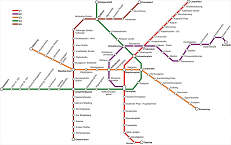

# Route Finder - Vienna U-Bahn

 

## Overview

This JavaFX application allows the user to search for and find routes between stations on a railway system. 
Specifically the Vienna U-Bahn in this instance.

## How It Works

The process includes:

   - Station details and attributes are loaded from a database.
   - A Graph data structure is created which stores information about stations, lines, and connections between them.
   -  uses an adjacency list to store the connections.
   - The class also provides methods for BFS algorithm and path finding.

    

## Images
### O
<figure>
  
  <figcaption>placeholder</figcaption>
</figure>

  

### b
<figure>
  
  <figcaption>placeholder</figcaption>
</figure>

  

  

## Features

- 

## Technical Details

- Dijkstra's Algorithm
- 

## A

  <figure style="margin: 0; text-align: center;">
    
  </figure>
 <figure style="margin: 0; text-align: center;">
    
  </figure>

