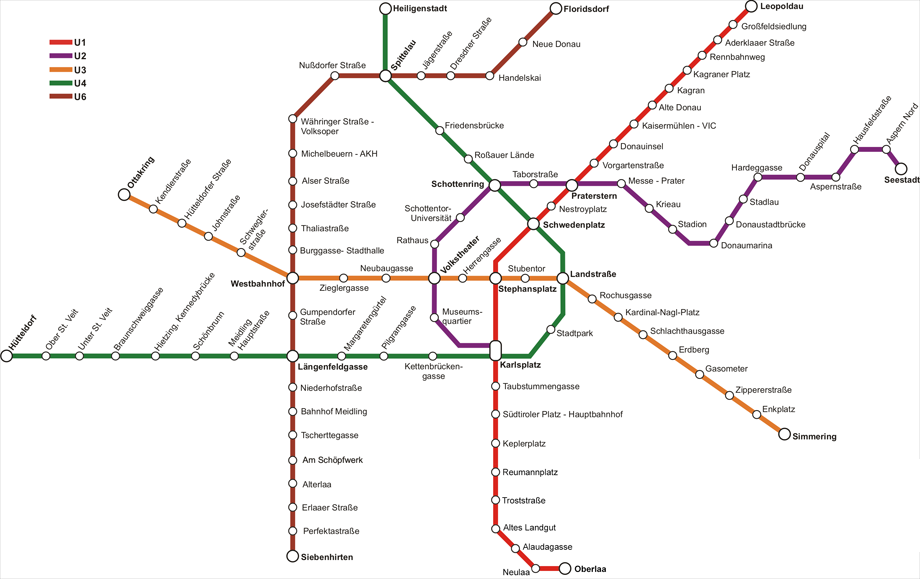
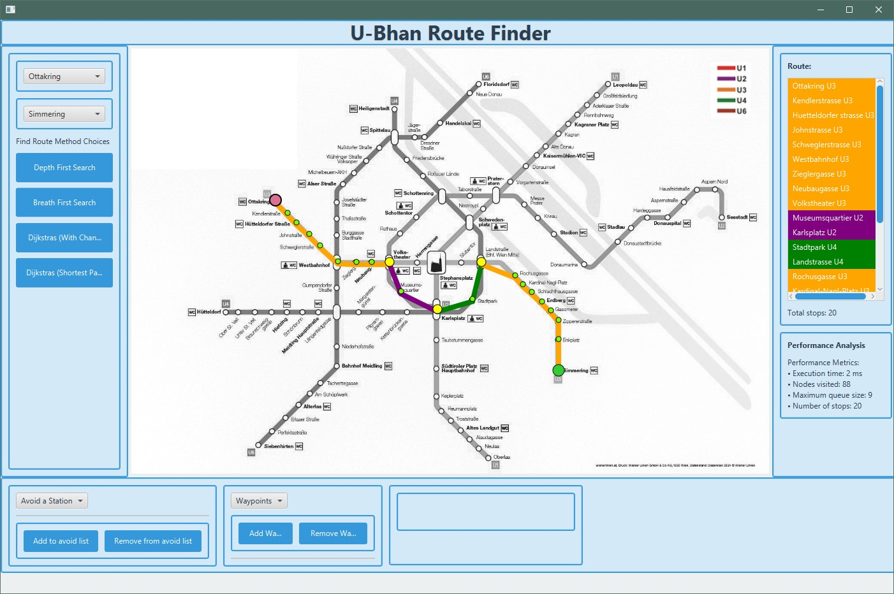
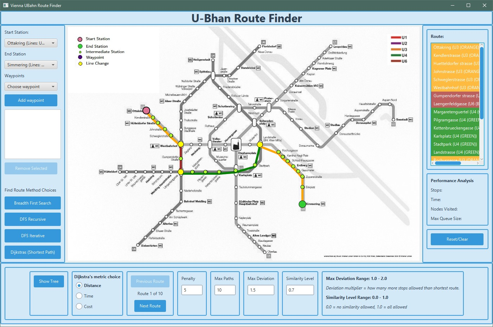
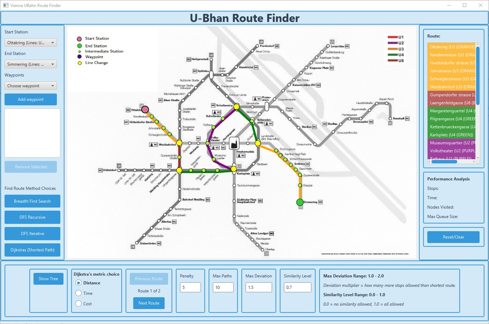
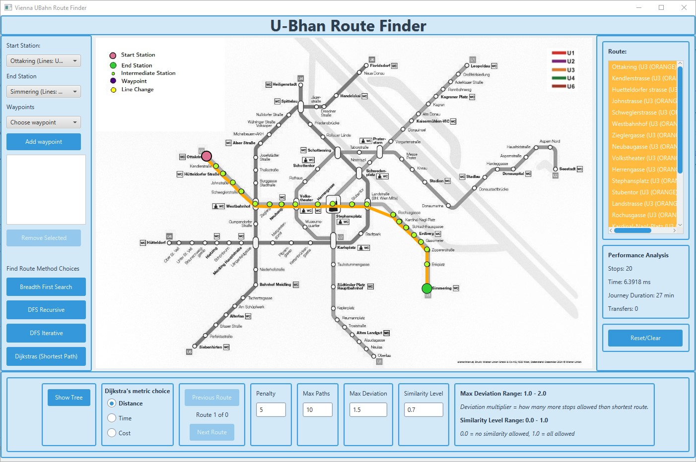

# Route Finder - Vienna U-Bahn

## Overview

This JavaFX application allows the user to search for and find routes between stations on a railway system.
Specifically the Vienna U-Bahn in this instance.

## How It Works

The process includes:
- Station details and attributes are loaded from a database.
- A Graph data structure is created which stores information about stations, lines, and connections between them.
- Uses an adjacency list to store the connections.
- Demonstrates the differences in various search algorithms some of which generate multiple possible routes.
-  BFS: Breadth First Search.
-  DFS: Depth First Search - Iterative.
-  DFS: Depth First Search - Recursive.
-  Dijkstra's Algorithm - Shortest Route / Least Cost.
- Colour coded route map and route stations results list.
- Various metrics calculated including:
-  Calculated distance between stations.
-  Euclidian distance, travel time, & processing time.

    

## Some route examples
Using the same start and finish stations to show the different results given by the various algorithms.

### Breadth First Search
<figure>
  
  <figcaption>Breadth First Search </figcaption>
</figure>

  

### Depth First Search - Recursive
<figure>
  
  <figcaption>Depth First Search - Recursive </figcaption>
</figure>

  

### Depth First Search - Iterative
<figure>
  
  <figcaption>Depth First Search - Iterative </figcaption>
</figure>

  

### Dijkstras Shortest Path
<figure>
  
  <figcaption>Dijkstras Shortest Path </figcaption>
</figure>

  

There are more images located in the images folder, and some videos of the app in use in the videos folder

<!--
## Features
## Technical Details
-->

## Documentation

Project-related documents can be found in the [docs folder](https://github.com/MichaelMcKibbin/ViennaUBahn/tree/master/docs). 
More screenshots can be found in the [images folder](https://github.com/MichaelMcKibbin/ViennaUBahn/tree/master/docs/images). 
Some videos of the app in use can be found in the [videos folder](https://github.com/MichaelMcKibbin/ViennaUBahn/tree/master/docs/videos). 
